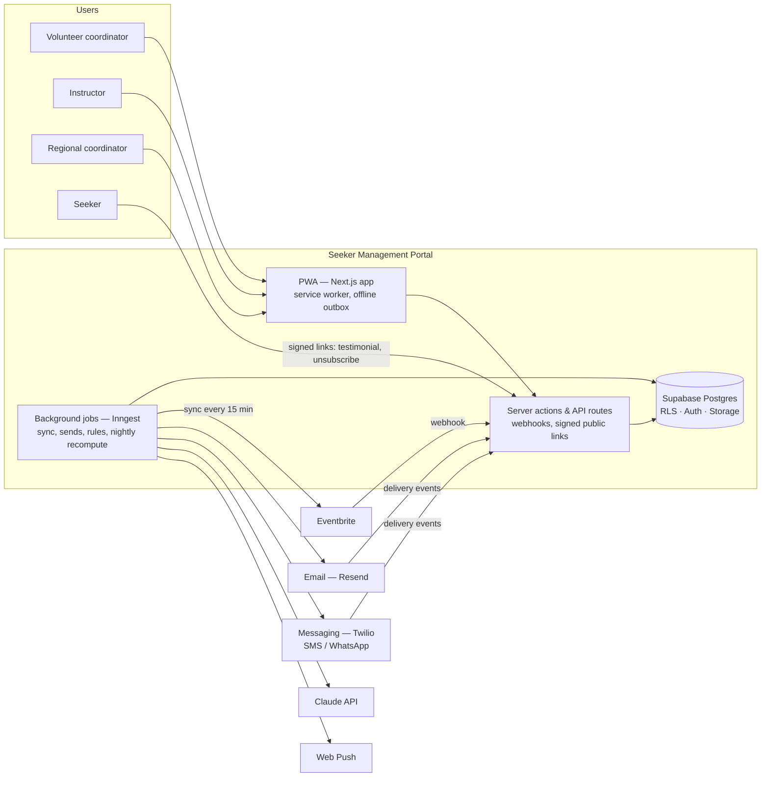
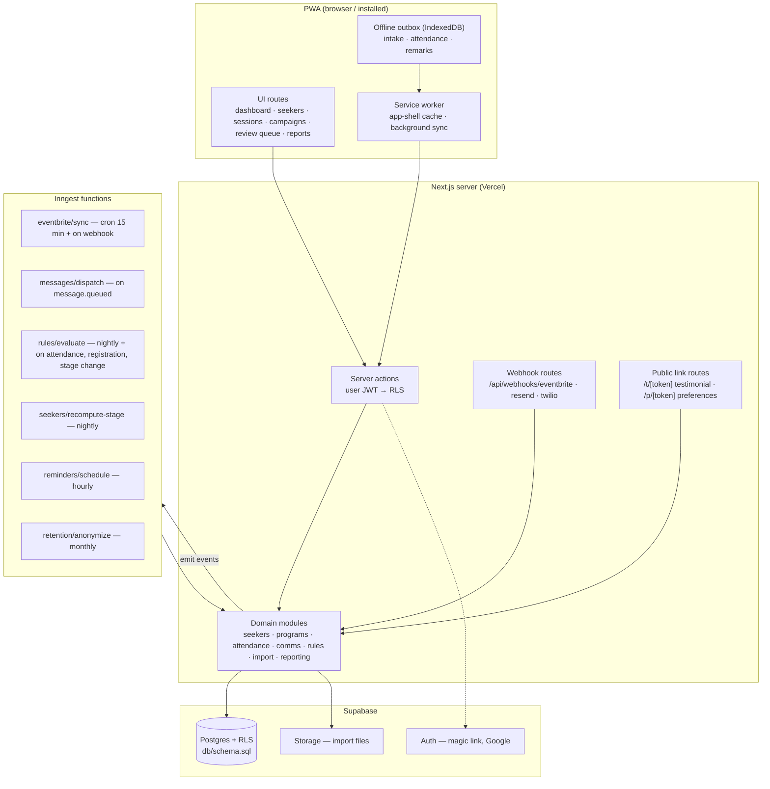
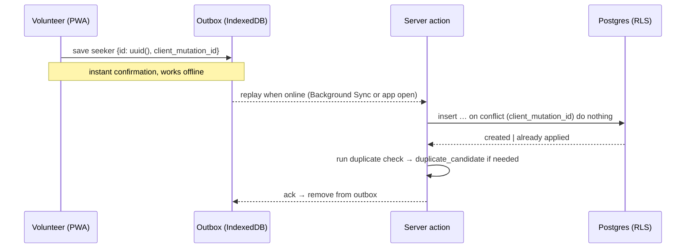

# Architecture — Seeker Management Portal

**Status:** Proposed v0.1 — for KG's review · **Date:** 2026-09-23 · **Inputs:** [PRD.md](PRD.md) (R1–R15, NFRs), [DATA_MODEL.md](DATA_MODEL.md), [IMPLEMENTATION_PLAN.md](IMPLEMENTATION_PLAN.md)

Decisions marked **AD-n** are proposals. Section 12 lists the ones that need an explicit yes before implementation starts.

-----

## 1. What the architecture must optimize for

Taken from the PRD's non-functional requirements, in priority order:

1. **Near-zero operations.** Volunteer-run, no IT staff. Every component is a managed service with a free tier; nothing self-hosted; nothing that needs patching.
2. **One codebase, installable on any phone.** PWA only. Instructor and volunteer flows must work offline and sync later.
3. **Privacy by construction.** Center-scoped access enforced in the database (RLS), not only in application code; suppression enforced by trigger; personal data minimized; remarks never leave the portal.
4. **Cheap at small scale, no rewrite at larger scale.** Free tiers today; the same architecture on paid tiers if the community grows.
5. **Replaceable edges.** Email, messaging, LLM, and Eventbrite sit behind thin interfaces so a provider can change without touching domain logic.

-----

## 2. System context



Seekers never log in. They reach the portal only through signed, expiring links in messages (submit a testimonial, manage preferences, unsubscribe).

-----

## 3. Architecture decisions

| ID | Decision | Rationale | Alternative considered |
|---|---|---|---|
| **AD-1** | **Next.js (App Router, TypeScript) as the single application** — UI, server actions, API routes, and webhook endpoints in one deployable. | One codebase for PWA and backend; server-rendered dashboards; mature PWA tooling (Serwist); Vercel free tier for non-commercial use. | Separate SPA + API service — two deployables, more ops, no benefit at this scale. |
| **AD-2** | **Supabase** for Postgres, Auth, Storage. | The data model's RLS design maps directly to `auth.uid()`; magic-link and Google sign-in are built in; managed backups; free tier. `db/schema.sql` becomes the first Supabase migration. | Neon + Auth.js — equally good Postgres, but auth and storage become two more things to run. |
| **AD-3** | **All user-initiated data access goes through the user's session; RLS is the authority.** Server actions use a Supabase client carrying the user's JWT. The service-role key is used only inside background jobs and webhook handlers, and every such write sets `center_id` explicitly. | Access control cannot be bypassed by a forgotten `where` clause. Matches DATA_MODEL §5. | App-layer authorization only — a single missed check leaks another center's seekers. |
| **AD-4** | **Inngest** for background jobs, crons, and event-driven workflows. | Durable step functions with retries and a dashboard; crons for Eventbrite sync, nightly stage recompute, rule evaluation, retention; free tier; no queue infrastructure to run. | Supabase `pg_cron` + Edge Functions — zero extra vendors, but weaker retries/observability and harder multi-step flows. Keep as the fallback if a vendor must be cut. |
| **AD-5** | **Resend** for email, with React Email for templates. | Delivery-event webhooks (sent, delivered, opened, clicked, bounced, complained) feed R12 directly; free tier covers initial volume; one-click unsubscribe headers supported. | Postmark — stronger deliverability reputation at volume; revisit if bounce/complaint rates or volume warrant it. |
| **AD-6** | **Twilio** for both SMS and WhatsApp, behind a `MessagingProvider` interface. | One vendor for either channel keeps the open channel question (PRD Q6) from blocking the build; STOP handling and delivery callbacks are standard. | Meta WhatsApp Cloud API directly — cheaper per message, WhatsApp-only, more integration work. |
| **AD-7** | **Claude API** for follow-up drafting, server-side only, inside guardrails. | Drafts are generated from an approved `template` plus a minimal seeker context (first name, program, last attendance, stage); never remarks, never other seekers. Output is stored as a `message` with `review_status = pending`; `generation_meta` records model and prompt version. | Rule-only templated text — simpler, but the PRD explicitly asks for dynamic content. The review queue keeps humans in control either way. |
| **AD-8** | **Offline-first instructor flows** via a service worker (Serwist) plus an IndexedDB outbox (Dexie). | Intake, attendance, and remarks write locally first with client-generated UUIDs and a `client_mutation_id`; a sync worker replays the outbox when online. Background Sync where the browser supports it (Android Chrome); retry-on-open elsewhere (iOS Safari). | Online-only forms — fails the PRD's "< 60 s on a phone, including with no connectivity". |
| **AD-9** | **Web Push (VAPID)** for instructor reminders, with email/message fallback. | Standard `web-push`; subscriptions stored in `push_subscription`. iOS requires the PWA installed to the Home Screen — part of onboarding, and the reminder job falls back to email/message when no subscription exists. | Native push — needs native apps, which are out of scope. |
| **AD-10** | **Vercel** for hosting, **Sentry** for error tracking, Inngest dashboard for job visibility, `audit_log` for domain events. | All free tiers; deploy previews per pull request; no servers. | Fly.io / Render containers — more control, more ops. |
| **AD-11** | **Signed public links** (HMAC tokens with purpose, seeker id, expiry) for seeker-facing actions. | No seeker accounts (PRD out of scope) yet secure per-seeker actions; tokens are single-purpose and expire. | Magic-link accounts for seekers — heavier, and a future option only. |
| **AD-12** | **Secrets and third-party tokens** live in Vercel environment variables; Eventbrite OAuth tokens are encrypted (AES-GCM with an app key) before being stored in `eventbrite_connection.access_token_enc`; every inbound webhook verifies the provider's signature. | Protects the highest-value secrets; webhook forgery cannot create or alter data. | Plaintext tokens in the database — unacceptable for a public-facing volunteer system. |

-----

## 4. Components



### 4.1 Domain modules (one folder each)

| Module | Owns | Key rules |
|---|---|---|
| `seekers` | seeker, consent, duplicate candidates, merge, anonymize | Dedupe on every write path (intake, import, Eventbrite); merge preserves history; anonymize rewrites contact fields and message addresses |
| `programs` | region, center, program, session, registration, Eventbrite mapping | Session is the unit Eventbrite maps to (decision, 2026-09-22) |
| `attendance` | attendance, remark, roster | Marks are idempotent by `(session_id, seeker_id)` and `client_mutation_id`; a mark emits `attendance.recorded` |
| `comms` | template, campaign, message, message_event, suppression, preferences | Every send passes through one `enqueueMessage()`; the DB trigger is the last line of defense, this function is the first |
| `rules` | rule, rule_run, follow_up_task, AI drafting | `evaluate(trigger, seeker)` → checks cooldown and suppression → creates a message (draft or queued) or a task; one `rule_run` per `(rule, seeker, trigger_key)` |
| `import` | import_batch, import_row, template validation, normalization (E.164, ISO-2, US state) | Never auto-merges ambiguous rows; outcomes per IMPORT_TEMPLATE.md |
| `reporting` | center dashboard, regional rollup, deliverability — SQL views | Regional reports read views only, never raw seeker rows |

### 4.2 Application layout (proposed)

```
src/
  app/
    (portal)/            authenticated UI: dashboard, seekers, sessions, campaigns, review, reports, admin
    (public)/t/[token]   testimonial form
    (public)/p/[token]   preferences / unsubscribe
    api/webhooks/{eventbrite,resend,twilio}/route.ts
    api/inngest/route.ts
  modules/{seekers,programs,attendance,comms,rules,import,reporting}/
    schema.ts            zod schemas (shared by forms, actions, importer)
    queries.ts           reads (RLS-scoped client)
    actions.ts           server actions (writes)
    events.ts            Inngest events this module emits
  jobs/                  Inngest functions (one file per function)
  lib/
    supabase/            browser client, server client, service-role client (jobs only)
    providers/           EmailProvider (Resend), MessagingProvider (Twilio), LlmProvider (Claude), PushProvider
    crypto/              token signing, Eventbrite token encryption
    normalize/           phone (E.164), country (ISO-2), US state
  offline/
    db.ts                Dexie schema: outbox, cached rosters
    outbox.ts            enqueue / replay with idempotency keys
    sync.ts              online detection, background sync registration
supabase/
  migrations/            generated from db/schema.sql, then incremental
  seed.sql               synthetic dev data only
db/                      schema.sql, smoke_test.sql (kept as the readable source of truth)
```

-----

## 5. Key flows

### 5.1 Offline intake and attendance (R1, R5)



Conflicts are last-write-wins on `updated_at`; every write is in `audit_log`, so a clobbered edit is recoverable.

### 5.2 Eventbrite registration (R3)

Webhook `order.placed` → verify signature → look up `eventbrite_event` by event id → resolve `session` and its `program` → dedupe attendee by email/phone → upsert `seeker` (source `eventbrite`, unassigned center unless the session's center is used — it is) → insert `registration` with `session_id`, `external_id` = attendee id → record `consent` (source `eventbrite`) → emit `registration.created`. The 15-minute cron reconciles missed webhooks by listing attendees changed since `last_synced_at`.

### 5.3 Sending anything (R8, R9, R6, R7)

`comms.enqueueMessage({recipient, channel, template, variables})` → render → check latest `consent` and `suppression` → insert `message` (`queued`, or `suppressed` — the DB trigger also enforces this) → emit `message.queued` → Inngest `messages/dispatch` calls the provider → stores `provider_message_id` → provider webhooks append `message_event` rows → `bounced`/`complained` events insert a `suppression` row, which cascades to `consent` by trigger.

### 5.4 Rule → AI draft → review → send (R13)

```mermaid
sequenceDiagram
  participant T as Trigger (attendance.recorded, nightly cron)
  participant R as rules/evaluate
  participant L as Claude API
  participant Q as Review queue (UI)
  participant C as comms.enqueueMessage
  T->>R: seeker, trigger, trigger_key
  R->>R: match enabled rules; skip if cooldown or suppressed → rule_run
  alt action = task
    R->>R: follow_up_task → assignee = mentor ?? center coordinator
  else action = message, template approved
    R->>L: template + minimal seeker context (no remarks)
    L-->>R: draft body
    R->>C: message {generated_by: llm, review_status: pending | not_required}
    C-->>Q: appears in review queue when pending
    Q->>C: approve → status queued → dispatch
  end
```

### 5.5 Unsubscribe (R11)

Every email carries `List-Unsubscribe` headers and a `/p/[token]` link; every message supports STOP. Both paths insert into `suppression`; the trigger records withdrawn consent. Nothing else has to remember.

-----

## 6. Security and privacy

- **Authentication:** Supabase Auth — magic link and Google sign-in for admins, coordinators, instructors. `app_user.id` = auth user id. Seekers have no accounts.
- **Authorization:** `role_assignment` + RLS policies (DATA_MODEL §5). Server actions never use the service-role key. Jobs and webhooks do, and set `center_id` explicitly on every row they write.
- **Public links:** HMAC-signed tokens `{purpose, seeker_id, exp}`; single purpose; 30-day expiry for testimonials, long-lived for preferences (revocable by rotating the key). Rate-limited.
- **Webhooks:** signature verification for Eventbrite, Resend, and Twilio; idempotent handlers keyed on provider ids.
- **Secrets:** Vercel env vars; Eventbrite tokens encrypted at rest; no secrets in the repository (`.env.example` only).
- **PII minimization:** no health data, IDs, DOB, or street address anywhere in the schema; remarks are internal and excluded from LLM prompts and exports by default.
- **Auditability:** `audit_log` for exports, merges, anonymizations, bulk sends, role changes.
- **Browser hardening:** strict CSP, HTTPS only, secure cookies, no third-party scripts beyond Sentry.

-----

## 7. Environments and delivery

| Environment | Where | Data |
|---|---|---|
| Local | Next.js dev server + Supabase CLI local stack (Docker) + Inngest dev server | `supabase/seed.sql` — synthetic only |
| Preview | Vercel preview deployment per pull request | Shared dev Supabase project, synthetic data |
| Production | Vercel production + Supabase production project | Real data; access limited to the steward and one backup admin |

**CI (GitHub Actions) on every pull request:** typecheck, lint, unit tests; load `db/schema.sql` into a Postgres service container and run `db/smoke_test.sql` (already written); Playwright smoke test of intake and attendance including the offline path.

**Migrations:** `db/schema.sql` remains the readable source of truth for the initial schema; Supabase CLI generates `supabase/migrations/0001_initial.sql` from it, and later changes are incremental migration files reviewed in pull requests.

-----

## 8. Observability

- **Errors:** Sentry (browser + server), free tier, PII scrubbing on.
- **Jobs:** Inngest dashboard — every run, step, retry, and failure with payloads.
- **Deliverability:** `message_event` → the R12 dashboard (views in `reporting`).
- **Domain audit:** `audit_log`.
- **Uptime:** a free external ping (e.g., UptimeRobot) on `/api/health`, which also keeps the free-tier database from pausing (see §9).

-----

## 9. Cost at initial scale

| Service | Tier | Notes and watch-outs |
|---|---|---|
| Vercel | Hobby — free | Non-commercial use only; a volunteer community project qualifies. |
| Supabase | Free | **Projects pause after about a week without traffic.** The health ping and the 15-minute sync cron prevent this. Database size limit is generous for this data volume. |
| Inngest | Free | Fine for the run volumes in Phases 1–3. |
| Resend | Free | Daily and monthly send caps; move to the first paid tier when weekly-program volume exceeds them. |
| Twilio | Pay as you go | Cost per message; WhatsApp business templates need Meta approval (lead time). This is the one line item that depends on the open budget question. |
| Claude API | Pay as you go | Drafts are short and only for rule-triggered follow-ups; cost is small relative to messaging. |
| Sentry | Developer — free | |
| Domain | ~annual fee | Needed for sending reputation (SPF, DKIM, DMARC). |

Ownership of these accounts is the PRD's open question 3 — the steward should hold them, with one backup admin.

-----

## 10. Phase mapping

| Phase | Architecture delivered |
|---|---|
| **1 — Capture** | Next.js app + PWA shell; Supabase project, `0001_initial` migration, RLS; Auth with roles; offline outbox for intake and attendance; import pipeline (Storage upload → parse → normalize → outcomes); Eventbrite OAuth, webhook, and 15-minute reconcile job; center dashboard views; CI with schema + smoke test. |
| **2 — Communicate** | `comms` module and `enqueueMessage`; Resend and Twilio providers with webhooks; suppression and preferences link; campaign audience builder; instructor reminders job with Web Push; volunteer nudge job; deliverability views; testimonial link and moderation. |
| **3 — Anticipate** | `rules` module and evaluate job; starter rule library; Claude drafting with review queue; stage recompute and engagement views; regional rollup views; retention job. |

-----

## 11. Risks

| Risk | Mitigation |
|---|---|
| Free-tier database pauses on inactivity | Health ping + cron traffic; budget for the paid tier before Phase 2 if traffic stays low |
| iOS: no Background Sync, push needs Home Screen install | Retry-on-open sync; install step in onboarding; email/message fallback for reminders |
| WhatsApp template approval delays Phase 2 | Decide channel during Phase 1; submit templates early; SMS/email work meanwhile |
| Service-role misuse in jobs | Single `serviceClient()` helper that requires an explicit `center_id` argument on writes; code review checklist |
| Vendor lock-in (Inngest, Resend, Twilio) | Provider interfaces in `lib/providers`; events are plain JSON; the DB is plain Postgres |
| Volunteer maintainers after handover | Managed services only; runbook in `docs/`; one-command local setup; CI guards the schema |

-----

## 12. Decisions needing your yes

1. **Supabase** (Postgres + Auth + Storage) over Neon + Auth.js — AD-2.
2. **Inngest** for jobs over Supabase-native cron/edge functions — AD-4.
3. **Resend** for email (Postmark as the upgrade path) — AD-5.
4. **Twilio** for SMS and WhatsApp behind one interface — AD-6.
5. **Vercel** hosting + **Sentry** — AD-10.
6. Confirm the free-tier posture is acceptable for Phase 1, with the pause-on-inactivity caveat understood.

Everything else in this document follows from the PRD and data model and does not need a separate decision.
