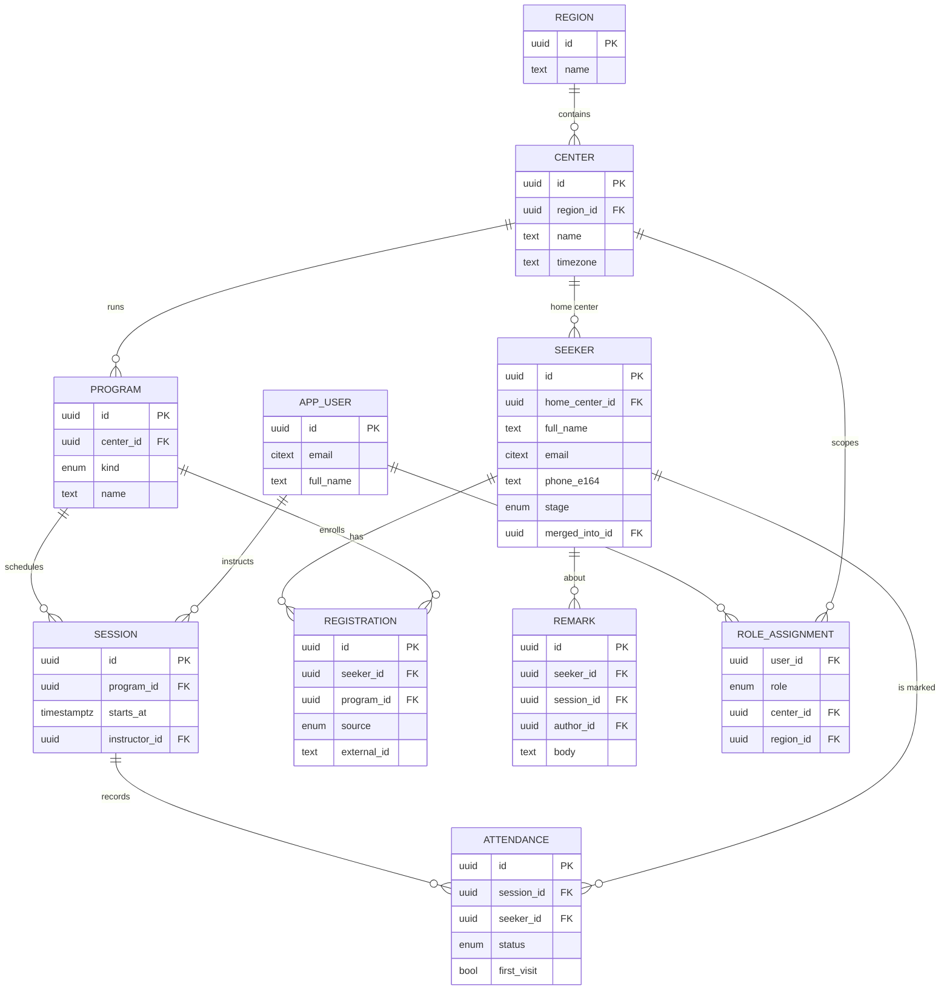
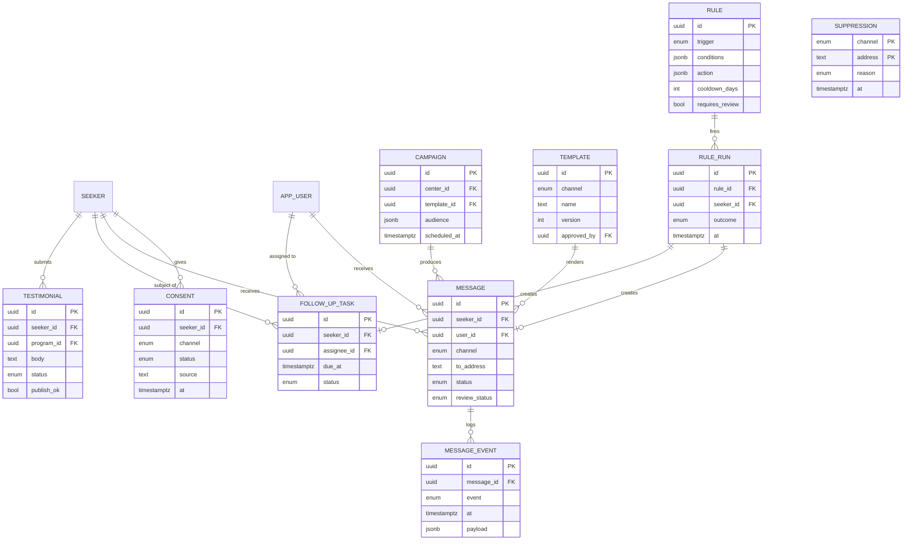

# Data Model — Seeker Management Portal

**Status:** Draft v0.2 — direction approved by KG, 2026-09-22; decisions on regions, Eventbrite mapping, mentors, and unassigned seekers applied same day · **Target:** PostgreSQL 15+ (Supabase or Neon) · **DDL:** [`db/schema.sql`](../db/schema.sql) (first pass, not yet applied anywhere)
**Companion to:** [PRD.md](PRD.md) (R1–R15) and [IMPLEMENTATION_PLAN.md](IMPLEMENTATION_PLAN.md)

-----

## 1. Design principles

Every choice below traces to a requirement or NFR in the PRD.

1. **`center` is the tenancy boundary.** Every seeker-scoped row carries a denormalized `center_id`, so access control (R15) is a cheap row-level-security predicate rather than a join chain. `region` groups centers for regional rollups (R14).
2. **Seeker identity is by normalized contact; duplicates are merged, never deleted.** Partial unique indexes on `email` (citext) and `phone_e164`; later-found duplicates set `merged_into_id` so history survives (R1, R2).
3. **Suppression is keyed by address, not by seeker.** An unsubscribed email or phone stays suppressed through re-imports, merges, and deletions (R11). A database trigger — not only app code — enforces it.
4. **Attendance, messages, delivery events, and consent are append-only.** Journey stage, "due for follow-up", and all dashboards are derived from them (R5, R12, R14). Derived fields are stored for speed but never hand-edited.
5. **Client-generated UUIDs and idempotency keys** on everything the PWA writes offline — seeker intake, attendance, remarks (R1, R5).

-----

## 2. Entity-relationship diagrams

### Core — people, programs, attendance



### Communication, consent, automation



`SUPPRESSION` intentionally has no foreign key to `SEEKER` — see principle 3. Not drawn: `push_subscription`, `duplicate_candidate`, `eventbrite_connection`/`eventbrite_event`, `import_batch`/`import_row`, `audit_log`. All are defined below and in the DDL.

-----

## 3. Entities

Field lists are complete for the first pass; types follow the DDL. `center_id` marked *(denorm)* is copied from the parent for RLS.

### 3.1 Organization & access

| Table | Fields | Notes |
|---|---|---|
| `region` | `id`, `name` | Groups centers for regional coordinators. Assumes a center belongs to exactly one region. |
| `center` | `id`, `region_id`, `name`, `address`, `city`, `country_code`, `timezone`, `is_active` | `timezone` renders session times locally; supports international centers. |
| `app_user` | `id`, `email` (citext, unique), `full_name`, `phone_e164`, `locale`, `is_active` | On Supabase, `id` equals the auth user id. |
| `role_assignment` | `user_id`, `role`, `center_id`, `region_id` | Roles: `admin` (no scope), `regional_coordinator` (region), `volunteer_coordinator` / `instructor` (center). A check constraint enforces the right scope per role. One user may hold several. |
| `push_subscription` | `user_id`, `endpoint` (unique), `p256dh`, `auth`, `user_agent` | Web Push targets for instructor reminders (R6). |

### 3.2 Seekers

| Table | Fields | Notes |
|---|---|---|
| `seeker` | `id`, `home_center_id` (nullable), `full_name`, `email`, `phone_e164`, `city`, `country_code`, `locale`, `how_heard`, `mentor_name`, `mentor_email`, `mentor_user_id`, `first_session_at`, `source` (`intake` / `import` / `eventbrite`), `stage` (`new` / `engaged` / `regular` / `lapsed`), `stage_changed_at`, `last_activity_at`, `merged_into_id`, `anonymized_at`, `client_mutation_id`, `created_by`, `created_at`, `updated_at` | One `full_name` field — no first/last split (localization NFR). Phone stored E.164 and check-constrained; `country_code` (ISO-2) defaults from the home center and drives phone normalization. At least one of email/phone required unless anonymized. `home_center_id` may be null (center unknown yet) — such seekers are visible to admins only until assigned. A mentor is the volunteer who personally guides the seeker; `mentor_user_id` is set when `mentor_email` matches a user and becomes the default assignee for follow-up tasks (R7). `stage` is derived (§6). |
| `consent` | `id`, `seeker_id`, `channel`, `status` (`granted` / `withdrawn`), `source`, `text_version`, `recorded_by`, `at` | Append-only; the current consent for a channel is the latest row. `text_version` records which consent statement the seeker saw. |
| `duplicate_candidate` | `seeker_a`, `seeker_b`, `score`, `reason`, `resolution` (`pending` / `merged` / `distinct`), `resolved_by`, `resolved_at` | Review queue for fuzzy matches (name trigram, same phone different email, etc.). `seeker_a < seeker_b` prevents mirrored pairs. |

### 3.3 Programs & attendance

| Table | Fields | Notes |
|---|---|---|
| `program` | `id`, `center_id`, `kind` (`weekly` / `public` / `intro`), `name`, `description`, `default_weekday`, `default_start_time`, `is_active` | A program owns sessions and defines an audience for R8. |
| `session` | `id`, `program_id`, `center_id` *(denorm)*, `starts_at`, `ends_at`, `location`, `instructor_id`, `status` (`scheduled` / `held` / `cancelled`), `notes` | Roster = registrations of the program plus anyone marked present. |
| `registration` | `id`, `seeker_id`, `program_id`, `session_id`, `center_id` *(denorm)*, `source`, `external_id`, `status`, `registered_at` | Unique `(seeker_id, program_id)`; unique `(source, external_id)` makes Eventbrite sync idempotent (R3). `session_id` is set for Eventbrite registrations so a `no_show` rule can compare against attendance at that session. |
| `attendance` | `id`, `session_id`, `seeker_id`, `center_id` *(denorm)*, `status` (`present` / `absent`), `first_visit`, `marked_by`, `marked_at`, `client_mutation_id` | Unique `(session_id, seeker_id)`. Offline-safe. |
| `remark` | `id`, `seeker_id`, `session_id`, `center_id` *(denorm)*, `author_id`, `body`, `tags`, `client_mutation_id`, `created_at` | Internal-only; never rendered into any message (privacy NFR). |
| `eventbrite_connection` | `id`, `eventbrite_org_id`, `access_token_enc`, `connected_by`, `connected_at` | Token encrypted by the app before storage. |
| `eventbrite_event` | `id`, `connection_id`, `eventbrite_event_id` (unique), `session_id`, `name`, `starts_at`, `last_synced_at` | Each Eventbrite event maps to exactly one dated `session`; the program follows from the session. Decided 2026-09-22. |

### 3.4 Communication

| Table | Fields | Notes |
|---|---|---|
| `template` | `id`, `channel`, `name`, `subject`, `body`, `variables`, `version`, `approved_by`, `approved_at`, `is_active` | Unique `(name, version)`. AI drafts must reference an approved template (R13). |
| `campaign` | `id`, `center_id`, `region_id`, `template_id`, `name`, `audience` (jsonb), `scheduled_at`, `status`, `created_by` | `audience` is a segment definition (program history, attendance, recency, center) resolved to recipients at send time (R9). `center_id` null = regional/global. |
| `message` | `id`, `seeker_id` *or* `user_id` (exactly one), `center_id`, `channel`, `template_id`, `campaign_id`, `rule_run_id`, `to_address`, `subject`, `body_rendered`, `generated_by` (`template` / `llm`), `generation_meta`, `review_status` (`not_required` / `pending` / `approved` / `rejected`), `reviewer_id`, `reviewed_at`, `status` (`draft` / `queued` / `suppressed` / `sent` / `delivered` / `bounced` / `failed`), `provider`, `provider_message_id`, `sent_at` | One table for seeker communications (R8–R10), instructor reminders (R6), and volunteer nudges (R7). An AI draft is simply a message with `review_status = pending`; the review queue is a filter. |
| `message_event` | `id`, `message_id`, `event` (`queued` / `sent` / `delivered` / `opened` / `clicked` / `bounced` / `complained` / `failed`), `at`, `payload` | Provider webhooks land here; the deliverability dashboard aggregates it (R12). |
| `suppression` | `(channel, address)` PK, `reason` (`unsubscribe` / `stop` / `hard_bounce` / `complaint`), `source_message_id`, `at` | Address is lower-cased email or E.164 phone. Inserting a row also records a `withdrawn` consent for any matching seeker (trigger). |

### 3.5 Automation & insight

| Table | Fields | Notes |
|---|---|---|
| `rule` | `id`, `name`, `trigger` (`no_show` / `missed_sessions` / `program_completed` / `inactive_days` / `stage_changed` / `new_seeker`), `conditions` (jsonb), `action` (jsonb), `cooldown_days`, `requires_review`, `center_id`, `is_enabled`, `created_by` | `action` is either `{type: message, template_id}` or `{type: task, assign_to, due_in_days}` — the "prompt a human" half of the vision (R13). |
| `rule_run` | `id`, `rule_id`, `seeker_id`, `trigger_key`, `outcome` (`message_created` / `task_created` / `skipped_cooldown` / `skipped_suppressed` / `awaiting_review`), `at` | Unique `(rule_id, seeker_id, trigger_key)` — a rule fires once per triggering event (e.g. per missed session). |
| `follow_up_task` | `id`, `seeker_id`, `center_id` *(denorm, nullable)*, `assignee_id`, `rule_run_id`, `reason`, `due_at`, `status` (`open` / `done` / `dismissed`), `completed_by`, `completed_at` | Volunteer nudges (R7) and rule-created tasks. `assignee_id` defaults to the seeker's mentor, else a coordinator of the home center. Powers "due for follow-up" on the center dashboard. |
| `testimonial` | `id`, `seeker_id`, `program_id`, `center_id`, `body`, `display_name`, `publish_ok`, `status` (`submitted` / `approved` / `rejected` / `published`), `moderated_by`, `moderated_at`, `submitted_at` | Submitted via signed link; moderated by admins (R10). |
| `import_batch` | `id`, `center_id`, `uploaded_by`, `filename`, `template_version`, counts, `status` | One row per uploaded file (R2). |
| `import_row` | `id`, `batch_id`, `row_number`, `raw`, `normalized`, `outcome` (`created` / `matched` / `needs_review` / `rejected`), `seeker_id`, `issues`, `resolved_by`, `resolved_at` | Rows needing review are resolved from a queue, never auto-merged. |
| `audit_log` | `id`, `actor_id`, `action`, `entity_type`, `entity_id`, `center_id`, `metadata`, `at` | Written for exports, merges, anonymizations, bulk sends, role changes. |

-----

## 4. Constraints, indexes, and guards

| Concern | Mechanism |
|---|---|
| No duplicate seekers | Partial unique indexes on `seeker.email` and `seeker.phone_e164` where `merged_into_id is null and anonymized_at is null`; GIN trigram index on `full_name` to surface fuzzy candidates |
| Idempotent sync and offline writes | `registration (source, external_id)` unique; `client_mutation_id` unique on `seeker`, `attendance`, `remark`; `rule_run (rule_id, seeker_id, trigger_key)` unique; `message (provider, provider_message_id)` unique |
| Suppression always wins | `BEFORE INSERT` trigger on `message` sets `status = suppressed` when `(channel, lower(to_address))` is in `suppression`; the sender only dispatches `queued` rows |
| Consent and suppression stay in sync | `AFTER INSERT` trigger on `suppression` writes a `withdrawn` consent row for matching seekers |
| Exactly one recipient | `check ((seeker_id is null) <> (user_id is null))` on `message` |
| Role scope is valid | Check constraint on `role_assignment` ties each role to the correct scope column |
| Hot paths | `attendance (seeker_id, marked_at desc)`, `message (seeker_id, created_at desc)`, `follow_up_task (center_id, status, due_at)`, `session (program_id, starts_at)`, `session (instructor_id, starts_at)`, partial index on `message` where `review_status = pending` |
| Retention | Scheduled job anonymizes seekers inactive past the retention window and without renewed consent (§8) |

-----

## 5. Access control (row-level security)

RLS is enabled on every center-scoped table. Three helper functions do the work:

- `current_app_user_id()` — reads the session's user id. The DDL reads `current_setting('app.user_id')`; on Supabase, replace the body with `select auth.uid()`.
- `visible_center_ids()` — the set of centers the current user may see: all centers for `admin`; the user's assigned centers for `volunteer_coordinator` and `instructor`; every center in the region for `regional_coordinator`.
- `center_visible(center_id)` — true when the center is in that set, **or** when `center_id` is null and the user is an admin. Null means "not assigned yet" (an unassigned seeker, a global campaign) and is deliberately admin-only until someone sets it.

Each scoped table gets one policy of the form:

```sql
create policy attendance_center_scope on attendance
  for all
  using      (center_visible(center_id))
  with check (center_visible(center_id));
```

Exceptions: `message` also allows rows where `user_id = current_app_user_id()` so instructors see their own reminders; `template`, `rule`, `suppression`, and `audit_log` are admin-only for writes and readable by all authenticated users (suppression must be readable by the sender).

A refinement to consider before Phase 3: give `regional_coordinator` access only to aggregate views rather than raw seeker rows, matching the PRD's "exportable without raw-data access".

-----

## 6. Derived data

| Derived value | Source | Rule (initial; tune after baseline) |
|---|---|---|
| `seeker.stage` | `attendance` | `new`: 0–1 attendances · `engaged`: 2+ attendances, last within 30 days · `regular`: 4+ attendances in the last 90 days · `lapsed`: no attendance in 60 days after having attended. Recomputed nightly; a change inserts a `stage_changed` trigger event for rules. |
| `seeker.last_activity_at` | `attendance`, `registration`, `message_event` (opened/clicked) | Max timestamp across sources; drives `inactive_days` rules and retention. |
| Due for follow-up | `attendance`, `follow_up_task`, `message` | Attended in the last 7 days *and* no `done` task or sent message since that attendance. Shown on the center dashboard (R14); a rule can turn it into a task (R7). |
| Center dashboard | all of the above | New this week/month, due for follow-up, returning vs lapsed, attendance counts — plain SQL views over the tables. |
| Regional rollup | center dashboard views + `region` | Seekers per center, retention (2nd session within 30 days; active at 90 days), sessions held, trends. Views only — no raw rows needed. |

-----

## 7. Offline sync and idempotency

- The PWA generates UUIDs client-side for `seeker`, `attendance`, and `remark`, and stamps each write with a `client_mutation_id`. Replays after reconnect are no-ops thanks to the unique constraint.
- Conflicts are last-write-wins on `updated_at`, and every write goes through `audit_log`, so a clobbered edit can be recovered.
- Duplicate detection on intake runs server-side at sync time; a probable duplicate becomes a `duplicate_candidate` rather than blocking the volunteer.

## 8. Privacy operations

- **Consent at capture:** the intake form writes a `consent` row per channel with the `text_version` shown.
- **Unsubscribe / STOP / bounce:** inserts into `suppression`, which cascades to `consent`. Nothing else needs to remember.
- **Correction / deletion on request:** an admin action sets `seeker.anonymized_at`, nulls contact and free-text fields, and rewrites `message.to_address` to a hash. Attendance counts survive for reporting; the person does not. Logged in `audit_log`.
- **Retention:** a scheduled job runs the same anonymization for seekers past the retention window (to be set — open question in the PRD) with no renewed consent.
- **Exports** are always logged with actor, scope, and row count.

-----

## 9. Decisions (KG, 2026-09-22)

1. A center belongs to exactly one region (`center.region_id`).
2. An Eventbrite event maps to one dated `session` (`eventbrite_event.session_id`, not null); the program follows from the session, and the registration records the session so no-shows can be detected.
3. A seeker's home center is optional at capture and import. Unassigned seekers are admin-only until a center is set; the import defaults a blank center to the batch's center when one is given.
4. Mentors are modeled on the seeker (`mentor_name`, `mentor_email`, `mentor_user_id`) and are the default assignee for follow-up tasks.
5. Historical import records consent as granted by default for email and messages (see [IMPORT_TEMPLATE.md](IMPORT_TEMPLATE.md)); one-click unsubscribe remains available on every send.

## 10. Open questions

1. Retention window length and whether "active" for retention includes opened messages or only attendance.
2. Should regional coordinators be limited to aggregate views from Phase 1, or is raw read access acceptable until Phase 3?

## 11. Requirement coverage

| Requirement | Tables |
|---|---|
| R1 Intake form | `seeker`, `consent`, `duplicate_candidate` |
| R2 Historical import | `import_batch`, `import_row`, `seeker`, `duplicate_candidate` |
| R3 Eventbrite sync | `eventbrite_connection`, `eventbrite_event` → `session`, `registration.session_id` |
| R4 Center & session directory | `region`, `center`, `program`, `session` |
| R5 Attendance & remarks | `attendance`, `remark` |
| R6 Instructor reminders | `message` (user recipient), `push_subscription`, `session` |
| R7 Volunteer follow-up nudges | `follow_up_task`, `seeker.mentor_user_id`, `message` |
| R8 Weekly program comms | `program`, `registration`, `template`, `campaign`, `message` |
| R9 Public program invitations | `campaign.audience`, `message`, `suppression` |
| R10 Testimonials | `testimonial` |
| R11 Unsubscribe & preferences | `suppression`, `consent` |
| R12 Delivery monitoring | `message`, `message_event` |
| R13 Rule engine + AI follow-ups | `rule`, `rule_run`, `message.review_status`, `follow_up_task` |
| R14 Dashboards & reporting | views over `attendance`, `follow_up_task`, `message`, `center`, `region` |
| R15 Access control | `role_assignment`, RLS policies, `audit_log` |
